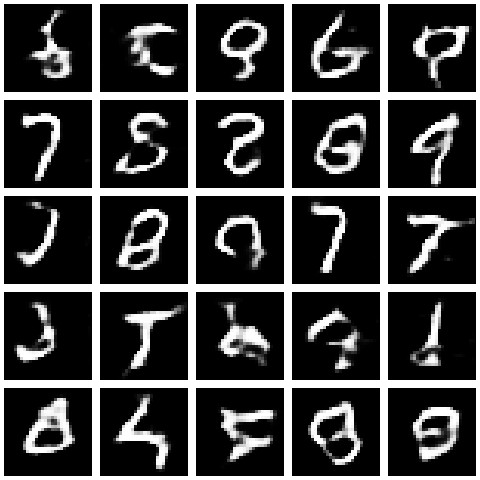

# Generative Adversarial Network to generate handwritten digits
> Uses [mnist dataset](http://yann.lecun.com/exdb/mnist/)

### How to use:
- Install packages
```r
install.packages(c("tensorflow", "keras", "tfdatasets"))

library(tensorflow)
install_tensorflow()
```
If a GPU is available:
```r
install_tensorflow(version = "gpu")
```
Use tensorflow eager execution
```r
library(keras)
use_implementation("tensorflow")

library(tensorflow)
tfe_enable_eager_execution(device_policy = "silent")

library(tfdatasets)
```

- Run the main.R file  
- (Optional) Set the number of epochs to train and number of examples to generate (found in main.R)

#### Sample generated images after training for 50 epochs


### References
Keydana (2018, Aug. 26). RStudio AI Blog: Generating images with Keras and TensorFlow eager execution. Retrieved from https://blogs.rstudio.com/tensorflow/posts/2018-08-26-eager-dcgan/